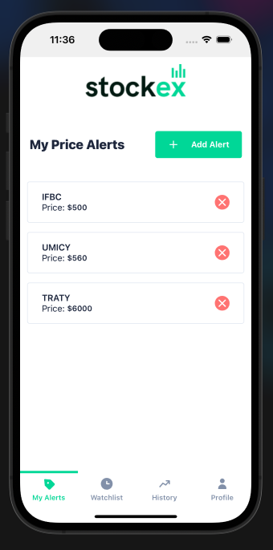
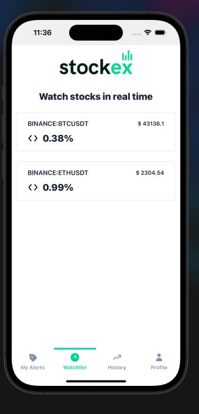
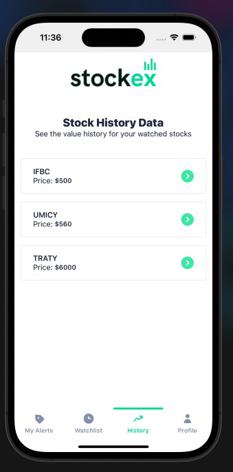
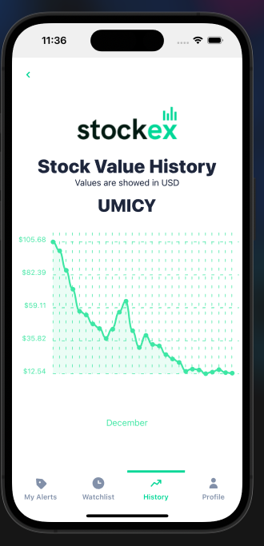

An app to watch for stock history and receive alerts.

## Features

- Add a price alert
- View and delete your price alerts
- Watch in real time the stocks that you configured
- See the stock history
- Authentication with Auth0
- Notifications when price goes higher

### Tech Stack

This project was made with React Native and with the next libraries: 

- <b>Navigation:</b> React Navigation
- <b>State:</b> Redux Toolkit
- <b>UI Components:</b> UI Kitten
- <b>Environments:</b> React Native Config
- <b>Storage:</b> React Native Async Storage
- <b>Notifications:</b> React Native Push Notifications
- <b>API:</b> Finnhub API

## App Screenshots

<table>
  <tr>
    <td align="center">
      
      
See your price alerts

    </td>
    <td align="center">
      
      
Watch your stocks

    </td>
  </tr>
  <tr>
    <td align="center">
      
      
Check the price history

    </td>
    <td align="center">
      
      
See how the stock has changed

    </td>
  </tr>
</table>

Made with love by @abulnes16
